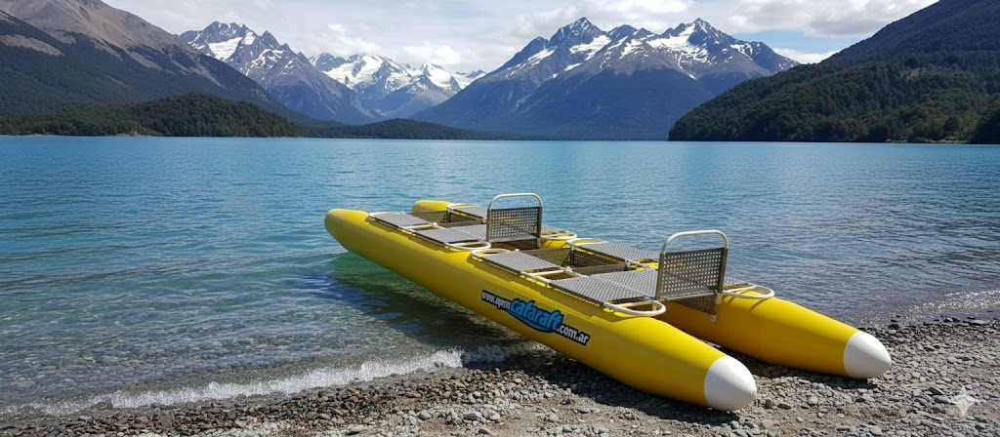

Este repositorio contiene los diseños de piezas en Solidworks 2020 para la fabricación de un bote plegable tipo catarraft, copia del producto de fabricación nacional, ya discontinuado, denominado [Amibote](http://www.amibote.com.ar/).

**Organización**

~~~
├───cad
│   ├───assemblies
│   ├───drawings
│   ├───parts
│   └───weldment_profiles
│       └───catarraft
│           └───Round_Tube
├───docs
└───exports
~~~

- `cad/parts` contiene las partes principales.
- `cad/drawings` contiene los planos de fabricación.
- `cad/assemblies` contiene ensamblajes de ejemplo.
- `cad/weldment_profiles` contiene los perfiles de caño de aluminio. Rationale: los caños se modelan como `weldment structures` para poder calcular automáticamente la longitud de los cortes y su cantidad.
- `doc` y `exports` contiene documentos adicionales y planos exportados a PDF.